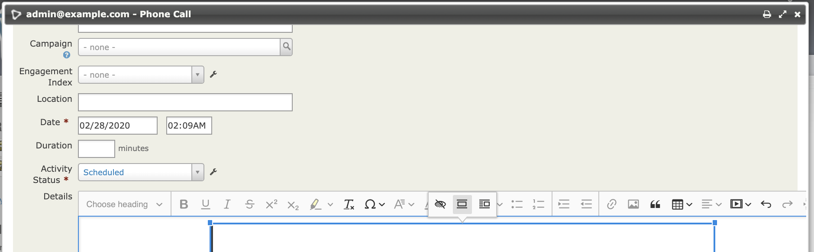
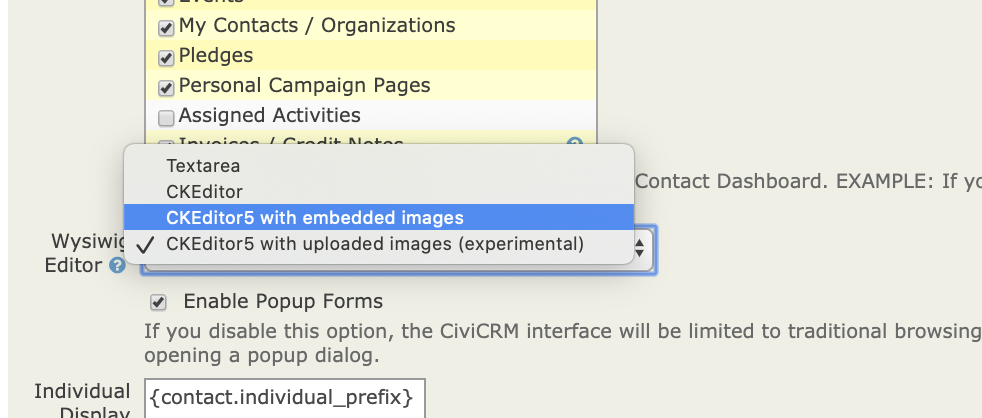

# ckeditor5



This adds ckeditor5 as a usable Wysiwig in CiviCRM. Ckeditor5 is being actively developed while CkEditor4 is in LTS stage so it
makes more sense to invest time in ckeditor5 than ckeditor4. However both have gaps.
                                                    
Ckeditor5 is better than
ckeditor4 when it comes to inserting formatted text from word / google (note
that you no longer see the paste from Word button as you just paste).

Also note ckeditor5 always uses an expandable window so the field will be small if it has
no data.

This implementation gets away from  the kcfinder file manager  which was last  updated
in 2014. KcFinder was  brittle around paths - especially  for sites with non-standard layouts
like symlinks or Drupal8.

Currently the packaged version comes with 2 options:

* CKEditor5 with uploaded images (recommended) - works in the same way as
  ckeditor4 did, by storing the files on the filesystem. It uses the elfinder
  plugin (eventually we could add support for other storage backends).
* CKEditor5 with embedded images - useful for sites operating behind a firewall
  as it embeds any uploaded images into the html (as a base64 blob), meaning
  that images embedded in emails will not be inaccessible to the recipients.
  For example a user who is sending an email from CiviCRM from behind a firewall
  who wants to add a signature cannot use the traditional ckeditor4 image insert
  because the image will be located behind the firewall and inaccessible to the
  reader. By embedding it it will be available. However, this can have an impact
  on the size of the database.

Note - there are discrepancies between email clients and some
might suppress or mis-display embedded images, as some might suppress linked ones.

The extension is licensed under [AGPL-3.0](LICENSE.txt).

## Requirements

* PHP v7.1+
* CiviCRM 5.24+

## Installation (Web UI)

This extension has not yet been published for installation via the web UI.

## Installation (CLI, Zip)

Sysadmins and developers may download the `.zip` file for this extension and
install it with the command-line tool [cv](https://github.com/civicrm/cv).

```bash
cd <extension-dir>
cv dl ckeditor5@https://github.com/FIXME/ckeditor5/archive/master.zip
```

## Installation (CLI, Git)

Sysadmins and developers may clone the [Git](https://en.wikipedia.org/wiki/Git) repo for this extension and
install it with the command-line tool [cv](https://github.com/civicrm/cv).

```bash
git clone https://github.com/FIXME/ckeditor5.git
cv en ckeditor5
```

## Usage

After installation it is  available as an option under
Administer->Customize Data and Screens->Display Preferences



## Known Issues

- The editor language only works in the ElFinder mode, and is set according to the current CiviCRM language, but Ckeditor5 ships its own set of translations which may not include all CiviCRM languages (see the files in js/ckeditor5/ckeditor-classic-build/translations).
- some session errors are visible when using elfinder with debug enabled - need to implement a  [session override](https://github.com/Studio-42/elFinder/wiki/Connector-configuration-options-2.1#session-218)
- The file browser for elFinder is in the background when popups are on - but given the
previous item this is OK for now.
- At the moment the elFinder seems to work well for uploading but less so for selecting
previously uploaded files
 - a  niche feature of ckeditor4 was a UI for configuration. The toolbar IS configured 
 through a javascript array so it would be  possible to find a way to customise that
 (but there  is  no current plan / demand for this)
- [view source is not a feature in ckeditor5](https://github.com/ckeditor/ckeditor5/issues/592)
- An interesting feature of ckeditor5 is that you can do more Gutenberg-like edit in place.
This would make sense possibly on a contribution page. No current plans.
- This uses the es6 script standard which works on browsers from around 2016/17

## A word about builds

CKeditor has a concept of builds constructed with npm. To change some components
(e.g include base64 uploader) it is necessary to used a build. These can be generated
using the [online builder](https://ckeditor.com/ckeditor-5/online-builder/). Alternatively
the classic editor [can be downloaded & installed](https://ckeditor.com/ckeditor-5/download/).
In the latter case there is no build or src directory or additional files.  So far I have just
downloaded & committed these as they come from the above links.

##  File manager

An ongoing challenge with ckeditor4 as implemented with CiviCRM is that the filemanager  (kcfinder)
is pretty hard to work with and requires some hacks to be able to figure out paths.

Ckeditor5 offers the following file managers
- Easy Image & CkFinder -  these  are  not open source
- [Base64 upload](https://ckeditor.com/docs/ckeditor5/latest/features/image-upload/base64-upload-adapter.html)
which is currently packaged & is firewall friendly.
- Integrations. The integration that currently looks most promising is [elFinder](https://github.com/Studio-42/elFinder)
This is currently being maintained (as opposed to kcfinder which is not)

Other issues to deal with
1) Ckeditor works with builds - I am shipping this with one downloaded build
and one created build. Not sure how this is  best managed going forwards.
2) We currently need a core fix tweak our settings pages to permit conditional settings based on metadata - ie
only show ckeditor5-specific-settings if $('#editor_id)  = ckeditor5 (this is something)
we also need for invoicing settings).
3) ckeditor builds are generated with npm - it's a bit unclear to me how we deal with that
in extensions (currently committing all the code to the extension). Moving ckeditor4 to a core
extension makes sense but we'd need to figure out this challenge.

 Note that I'm currently using the downloaded classic build for elfinder
 as opposed to the lightly customised one I used for the base-uploader
 - this has a slightly different structure -ie no build folder
