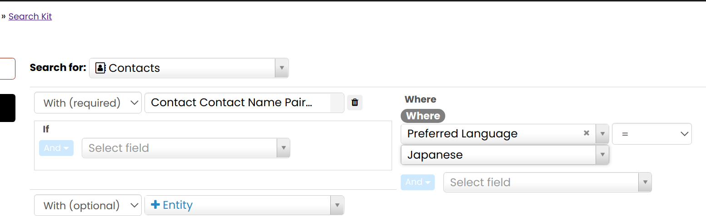

## Data management

Deduper provides some apis to help you keep your data in
a dedupable state.

- Address cleaning apis
- Name.parse v4 api
- Japanese family names table and api.

## Address cleaning apis
- apis email.clean, phone.clean, address.clean
- these run before deduping ensuring that
  each contact has exactly one primary of each of the above and only one of each location type.
  This latter could be argued as the UI permits multiple home emails but the dedupe (and I believe
  export) is unreliable in that scenario. The UI enforces a single address per location. For
  phones it is unique as a location-type combo.

### Japanese family names

Japanese names have the family name first and the individual name second.
Although CiviCRM calls the names 'first_name' and 'last_name' it is likely
that you will prefer to have the family name in the 'last_name' and the individual
name in the 'first_name' (If you prefer the reverse then you are still likely
to need to clean this up, but in the opposite direction.)

The deduper extension ships with a table of a few hundred
common family names and their anglicised equivalent.

You can access this table using a v4 api e.g

```
$contactNamePairs = \Civi\Api4\ContactNamePair::get()
  ->execute();
```

From CiviCRM version 5.39 onwards it is possible to
find contacts in search kit where the first_name is actually a
common Japanese family name (in kanji).



From CiviCRM version 5.39 onwards there is also an action to flip the
first and last names


If you wish to cleanup these names in bulk you can do it from the
command line with a command like this

echo '{"join":[["ContactNamePairFamily AS contact_name_pair_family","INNER",null,["first_name","=","contact_name_pair_family.name_b"]]],"limit":25,"chain":{"flip":["Contact","update",{"where":[["id","=","$id"]],"values":{"first_name":"$last_name","last_name":"$first_name"}}]}, "checkPermissions":false, "version":4, "limit":1000}' | drush cvapi  Contact.get --in=json

