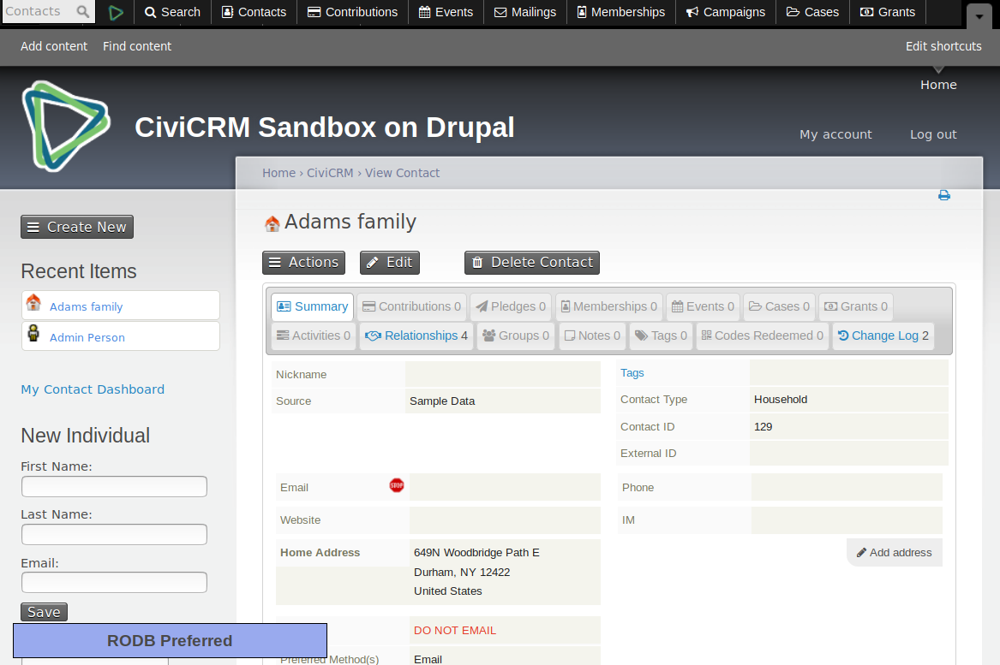

# CiviCRM Replay-on-Write Debug Utility (rpowdbg)

`rpowdbg` displays a debug panel as you browse a CivCRM site. By default, it
shows a messages, "RODB Preferred" -- which means that the system prefers
to service requests for this user by connecting to the read-only database
(RODB).

Suppose you make an edit -- such as changing the contact name from "Adams
family" to "Adams family values".  The edit cannot be serviced by RODB, so
the system will reconnect to the read-write database (RWDB).  The panel
expands:

This panel reveals a few key pieces of information:

* There is a cookie. As long as this cookie remains active, the user's
  requests will be directed to RWDB.
* The cookie will expire (in some number seconds). For testing purposes,
  you can force it to expire immediately.
* At the moment that it reconnected, there was a *buffer* -- a list of
  queries which would need to be executed on the RWDB.  The last query in
  the buffer is usually *the cause* of the reconnection.  To wit: when the
  user edits the contact's name, it leads to a query `UPDATE
  civicrm_contact ...`; to service this query, we switched from RODB to
  RWDB.

The extension is licensed under [AGPL-3.0](LICENSE.txt).

## Requirements

* PHP v5.6+
* CiviCRM 5.10+ (?)
* rpow

## Installation

This extension is bundled with `rpow`.  After installing `rpow`, simply
enable `rpowdbg`.  The new panel will appear automatically.
